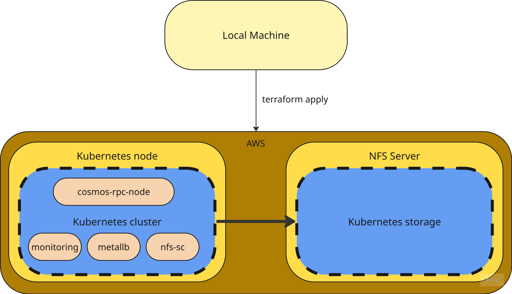

# P2P technical assignment

## Task

For this assignment, we would like you to fully automate with “one click”:

- The deployment of a local kubernetes cluster on your machine.
- The deployment of the **cosmos rpc node** on the **provider testnet network** to the local kubenetes cluster on your machine.
- The deployment of grafana and prometheus to your local kubernetes cluster to view the resources used such as cpu / memory / disk space etc..

You are **not limited t**o the above list or the tooling you use in order to do this -

Use the tools you would in a production environment to show us your skillset, approach and feel free to demonstrate additional techniques if you have time.

**Definition of done:** A fully automated one click deployment of a syncing / synced **cosmos rpc node** on the **provider testnet network** on the local kubernetes cluster with grafana dashboards to monitor basic metrics.

## Diagram

## Procedure

### Infrastructure

- Deploy two AWS VMs using terraform.
- Deploy Kubernetes single node cluster using ansible and kubeadm.
- Deploy NFS server on the second VM.
- Deploy MetalLB for LoadBalancer.
- Deploy Prometheus and Grafana for monitoring.

#### Steps:

##### Kubernetes Cluster
- Clone the repository.
- Change the directory to `terraform`.
- Create a file `terraform.tfvars` with the following content:

```hcl
ami = "ami-123456789abcdefg"
kube_instance_type = "t3.medium"
nfs_instance_type = "t3.medium"
key_name = "nmy-private-key-name"
profile = "aws-profile"
key_path = "/path/to/private/key"
```
- make sure the AWS key pair is added to private keys and has the same name as the one on AWS.
- Run `terraform init`.
- Run `terraform apply`. 

This will create two EC2 instances, install Kubernetes cluster `v1.31` on one machine and NFS server on another machine. At the end of the process, it will create a file `admin.conf` that can be used to connect to cluster. The NFS machine will be used to create PVCs on the Kubernetes cluster.

##### NFS server for Kubernetes cluster storage
- Deploy NFS subdir external provisioner on the Kubernetes cluster.

Once the Kubernetes cluster is up and running, replace `NFS_SERVER_IP` variable and run the following commands:

```bash
helm repo add nfs-subdir-external-provisioner https://kubernetes-sigs.github.io/nfs-subdir-external-provisioner/
helm repo update
helm install nfs-subdir-external-provisioner nfs-subdir-external-provisioner/nfs-subdir-external-provisioner -n kube-system --set nfs.server=<NFS_SERVER_IP> --set nfs.path=/srv/nfs_share
```

##### MetalLB for LoadBalancer
- Replace the `KUBERNETES_NODE_PUBLIC_IP` variable and deploy `MetalLB` on the Kubernetes cluster.
```bash
helm repo add metallb https://metallb.github.io/metallb
helm repo update
helm install metallb metallb/metallb --namespace metallb-system --create-namespace

IP="<KUBERNETES_NODE_PUBLIC_IP>/32" && \
cat <<EOF | envsubst | kubectl apply -f -
apiVersion: metallb.io/v1beta1
kind: IPAddressPool
metadata:
  name: single-ip
  namespace: metallb-system
spec:
  addresses:
    - $IP
---
apiVersion: metallb.io/v1beta1
kind: L2Advertisement
metadata:
  name: l2
  namespace: metallb-system
spec: {}
EOF
```

##### Monitoring
- Deploy Prometheus and Grafana on the Kubernetes cluster.

```bash
helm repo add prometheus-community https://prometheus-community.github.io/helm-charts
helm repo update
helm install prometheus prometheus-community/kube-prometheus-stack -n monitoring --create-namespace
```

### Cosmos RPC Node

- Deploy Cosmos RPC node on the Kubernetes in `cosmos-rpc-node-testnet/` folder.

```bash
kubectl create ns cosmos-rpc-node
kubectl apply -f cosmos-rpc-node-testnet/ -n cosmos-rpc-node
```
## Improvements

- Keep terraform state in S3 bucket.
- Deploy storage using Rook Ceph for better performance and reliability.
- Create a Helm chart for Cosmos RPC node.
- Create a CI/CD using Argocd to deploy Cosmos RPC node.